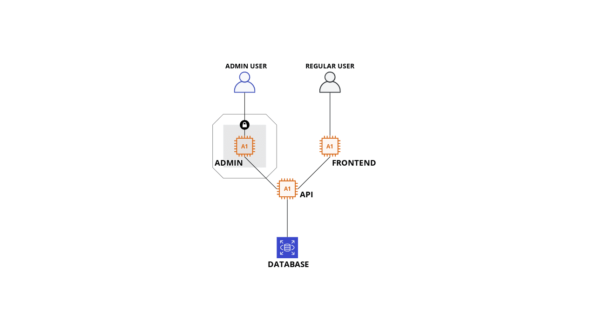

# room-reservation
## Architecture

Servers:
  - Admin
    - Where the admin CMS will be running
    - Should be IP locked so that only specific users can access
  - Frontend
    - User-facing application will run here
    - Can be available within the network only or for everyone, depending on usage
  - API
    - Should only be accessed by admin and frontend servers
    - Should be the only one that can access the database
  - Database
    - Only API should have an access
